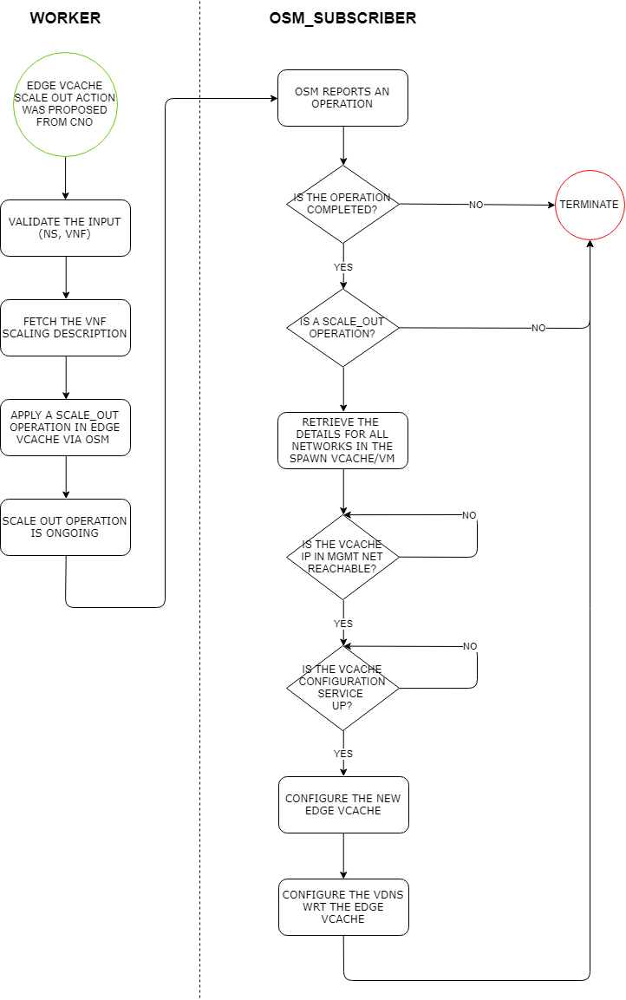

# 5G-MEDIA project - `actions-execution-engine` service

## Introduction
This service supports three types of operations:
- NFVO-based operations per network service or individual VNF
- VNF-specific operations per individual VNF e.g. VNF day1,2... configuration
- hybrid operations

The NFVO-based operations per NS includes:
- `vnf_scale_out`: VNF-level scale out in a running NS
- `vnf_scale_in`: VNF-level scale in in a running NS   
- `faas_vnf_scale_out`: serverless VNF-level scale out in a running NS
- `ns_instantiate`: Instantiate a NS based on NSD in given VIM (future usage)
- `ns_terminate`: Terminate a running NS (future usage)

The VNF-specific operations per individual VNF includes:
- `set_vtranscoder_profile`: vTranscoder day 1,2 configuration (UC1)
- `set_vtranscoder_processing_unit`: vTranscoder placement - CPU/GPU (UC1)
- `set_vtranscoder_client_profile`: vTranscoder spectator quality (UC1)
- `set_vce_bitrate`: vCE day 1,2 configuration (UC2)
- `vCache VNF & vDNS day 0,1,2.. configuration` (UC3)

Moreover, the `actions-execution-engine` service  stores the optimization events in the influxDB.

For instance, in case of the vCDN service (UC3):
1. Upon the vCDN service instantiation, the executor configures the regular Edge vCache VNF and updates the vDNS configuration
2. When SS-CNO suggests *faas_vnf_scale_out*, executor invokes the Faas (bootstrap VNF web service); Faas orch configures the new faas edge vCache and updates the vDNS configuration
3. When SS-CNO suggests *faas_vnf_scale_in*, executor invokes the Faas (bootstrap VNF web service); Faas orch deletes the faas edge vCache and updates vDNS configuration
4. When SS-CNO suggests regular *vnf_scale_out*, executor configures the new regular edge vCache and updates the vDNS configuration
5. When SS-CNO suggest regular *vnf_scale_in*, executor deletes the regular edge vCache and updates the vDNS configuration
6. When the vCDN service is triggered to terminate, executor updates the vDNS configuration (remove the mappings both for regular and faas edge vCache VNFs)


## Requirements
- Python 3.5+ 
  + a set of python packages are used (see `requirements.txt`).
- The Apache Kafka broker must be accessible from the service
- The OSM NBI APIs must be accessible from the service.
- The InfluxDB must be accessible from the service.
- The Graylog must be accessible from the service.
- The vCDN elements must be accessible through the MGMT net [UC3].

## Configuration
Check the `settings.py` file:
- *DEBUG*: 1 for debug mode. Otherwise, 0.
- *KAFKA_SERVER*: The host and port of the 5G-MEDIA kafka.
- *KAFKA_CLIENT_ID*: The id of this kafka client.
- *KAFKA_API_VERSION*: The version of the 5G-MEDIA kafka.
- *KAFKA_EXECUTION_TOPIC*: The name of the 5G-MEDIA kafka topic in which the optimization actions are available.
- *KAFKA_CONFIGURATION_TOPIC*: The name of the 5G-MEDIA kafka topic in which this service pushes the configuration message.
- *KAFKA_GROUP_ID*: The consumer groups in kafka for each container's service.
- *OSM_IP*: The IPv4 of the OSM instance.
- *OSM_ADMIN_CREDENTIALS*: The admin credentials of the OSM instance.
- *OSM_COMPONENTS*: The URL of each OSM component
- *OSM_KAFKA_SERVER*: The host and port of the OSM kafka.
- *OSM_KAFKA_NS_TOPIC*: The name of the OSM kafka topic in which the NS events are arrived.
- *VDNS_IP*: The IPv4 in the MGMT network of the vDNS.
- *INFLUX_DATABASES*: The InfluxDB settings.
- *GRAYLOG_HOST*: The host/IPv4 of the Graylog server.
- *GRAYLOG_PORT*: The port of the Graylog server.


## Installation/Deployment

To build the docker image, copy the bash script included in the bash_scripts/ folder in 
the parent folder of the project and then, run:
```bash
   chmod +x build_docker_image.sh
   ./build_docker_image.sh
```

Given the docker image availability, there are 3 ways to deploy it:
 - using the MAPE docker-compose project
 - using the gitlab CI recipe  as standalone container
 - manual deployment as standalone container

Auto-deployment is supported for the master branch (in our lab and not in ENG). 
After each commit, the docker image is built and a new container is launched based on the `.gitlab-ci.yml` definition. 
A set of variables have been pre-defined in the CI/CD area in gitlab.

For manual deployment, download the code from the repository and set the below environment variables:
- *DEBUG*: 1 for debug mode. Otherwise, 0.
- *KAFKA_HOST*: The host of the 5G-MEDIA kafka.
- *KAFKA_PORT*: The port of the 5G-MEDIA kafka.
- *KAFKA_EXECUTION_TOPIC*: The name of the 5G-MEDIA kafka topic in which the optimization actions are available.
- *KAFKA_CONFIGURATION_TOPIC*: The name of the 5G-MEDIA kafka topic in which this service pushes the configuration message.
- *OSM_IP*: The IPv4 of the OSM instance.
- *OSM_USER*: The username of admin user in the OSM instance.
- *OSM_PWD*: The pwd of admin user in the OSM instance.
- *OSM_KAFKA_PORT*: The port of the OSM kafka.
- *VDNS_IP*: The IPv4 in the MGMT network of the vDNS.
- *INFLUXDB_IP*: The IPv4 of the InfluxDB. 
- *INFLUXDB_PORT*: The tcp port of the InfluxDB. 
- *INFLUXDB_DB_NAME*: The database name of the 5gmedia in InfluxDB.
- *INFLUXDB_USER*: The user's username of the InfluxDB. 
- *INFLUXDB_PWD*: The user's password of the InfluxDB. 
- *GRAYLOG_HOST*: The host/IPv4 of the Graylog server.
- *GRAYLOG_PORT*: The port of the Graylog server.

```bash
    $ sudo docker run -p 8889:3333 --name mape_execution --restart always \
        -e DEBUG=1 \
        -e KAFKA_HOST="192.168.111.17" \
        -e KAFKA_PORT="9092" \
        -e KAFKA_EXECUTION_TOPIC="ns.instances.exec" \
        -e KAFKA_CONFIGURATION_TOPIC="ns.instances.conf" \
        -e KAFKA_SPECTATOR_CONFIGURATION_TOPIC="topic_x"
        -e OSM_IP="192.168.1.188" \
        -e OSM_USER="admin" \
        -e OSM_PWD="admin" \
        -e OSM_KAFKA_PORT="9094" \
        -e VDNS_IP="192.168.111.20" \
        -e INFLUXDB_IP="192.168.111.17" \
        -e INFLUXDB_PORT="8086" \
        -e INFLUXDB_DB_NAME="monitoring" \
        -e INFLUXDB_USER="root" \
        -e INFLUXDB_PWD="root" \
        -e GRAYLOG_HOST="192.168.111.13" \
        -e GRAYLOG_PORT="12201" \        
        -dit actions-execution-engine
```

## Usage

Access the docker container:
```bash
$ sudo docker exec -it  actions_execution_engine bash
```

Two services are running in this docker container under the supervisor:
- worker
- osm_subscriber

Start the services through the supervisor:
```bash
$ service supervisor start && supervisorctl start {service_name}
```

Stop the execution service through the supervisor:
```bash
$ supervisorctl stop {service_name}
```

Stop the supervisor service:
```bash
$ service supervisor stop 
```

You are able to check the status of the services using your browser from the supervisor UI.
Type the URL: `http://{mape_ipv4}:{container_port}`


## Implementation Flow

Scale out of regular Edge vCache VNF, included in a vCDN service



## Authors
- Athanasoulis Takis <pathanasoulis@ep.singularlogic.eu>

## Contributors
 - Contact with Authors
 
## Acknowledgements
This project has received funding from the European Union’s Horizon 2020 research and innovation 
programme under grant agreement *No 761699*. The dissemination of results herein reflects only 
the author’s view and the European Commission is not responsible for any use that may be made 
of the information it contains.

## License
[Apache 2.0](LICENSE.md)


